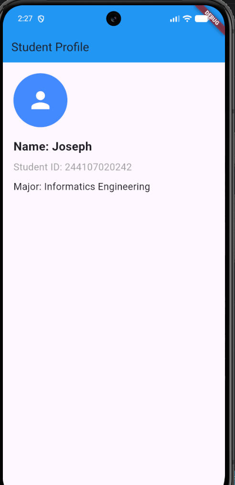

# Week 1: Student Profile Application

## Application Screenshot

## Setup Problem Encountered & Solved
**Problem:** After pushing my initial code and assets, all my repository images appeared broken on the GitHub website with a generic broken image icon, even though they displayed perfectly in my local VS Code editor preview window.

**Solution:** I discovered that local operating systems (like Windows) are case-insensitive when reading file paths, allowing `./photos/` to map to a physical folder named `Photos`. However, GitHub hosting servers run on Linux environments which are strictly case-sensitive. I solved this by changing all my file links in the Markdown code to use an uppercase "P" (`./Photos/`) to precisely match the directory name in the repository.
