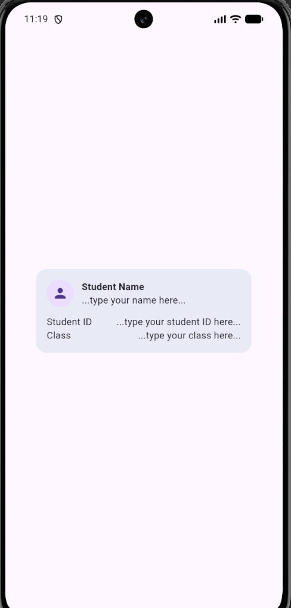
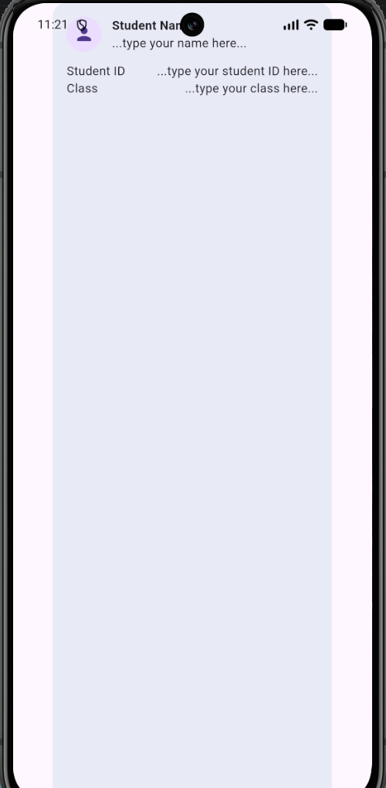
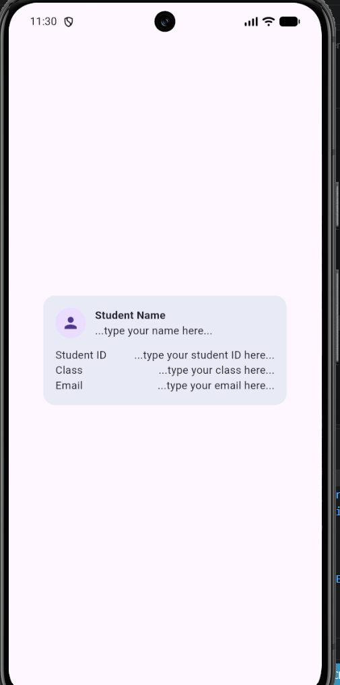
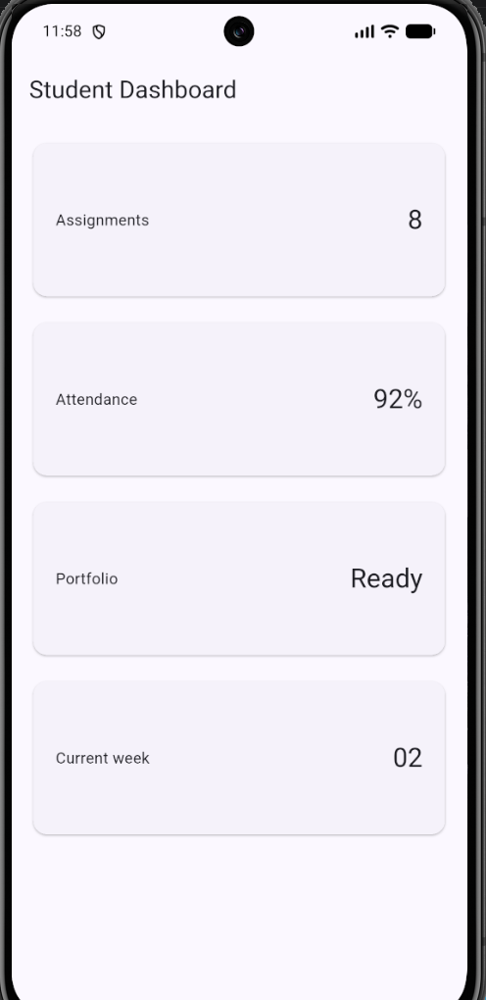
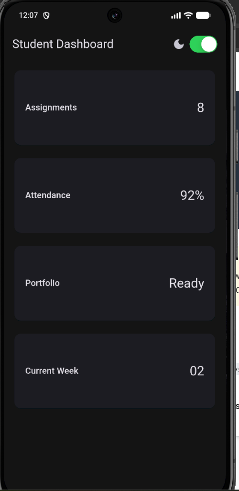
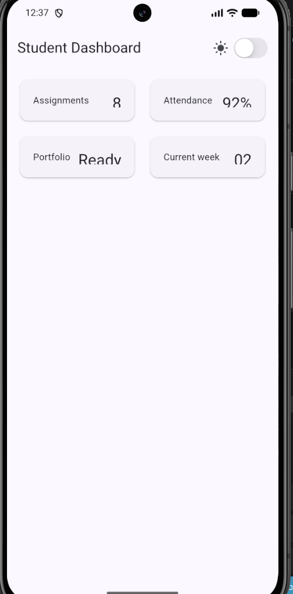
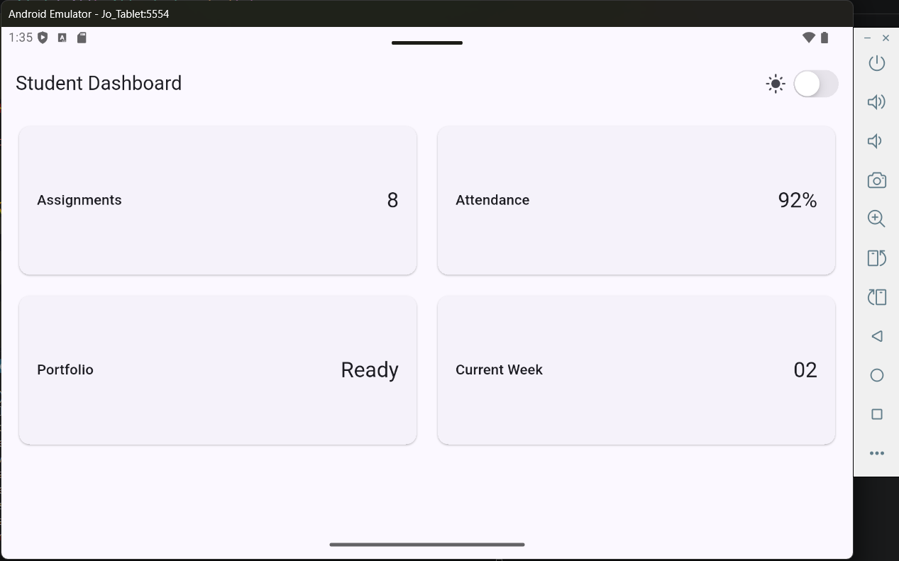
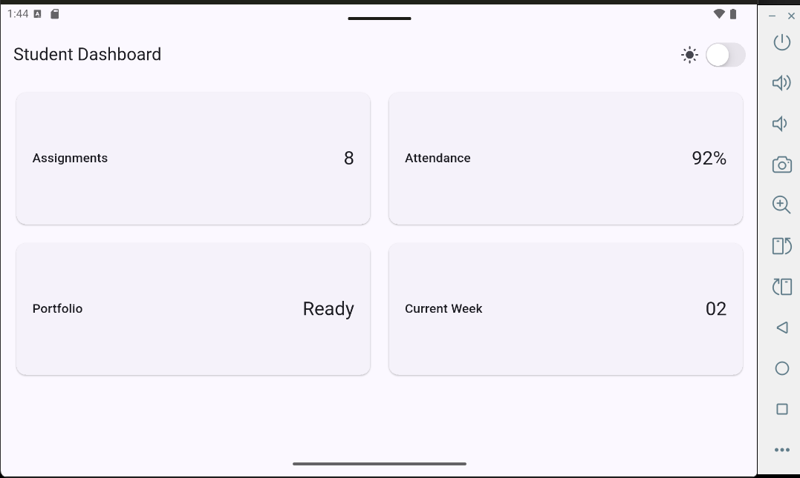

## Jobsheet: Matkul Mobile Programming Week 2

| *Informasi* | *Detail* |
| --- | --- |
| Mata Kuliah | Mobile Programming |
| Nama | Joseph Atem Deng Aruei |
| Absen | 17 |
| NIM | 244107020242 |

# Lab: simple layout (warm-up)

**After removing expanded**

**Replacing mainAxisSize**

**Adding one more data row (e.g. Email)**

# Lab: responsive dashboard

**Student dashboard**

**Change the 700 breakpoint and observe the column count.**

**Change themeMode to ThemeMode.dark, then restore ThemeMode.system.**

**Test the application at different emulator screen sizes.**

**Test the application at different emulator screen sizes.**

# Lab: Assignment and AI design exploration

## 📝 Reflection

---

## Reflection

