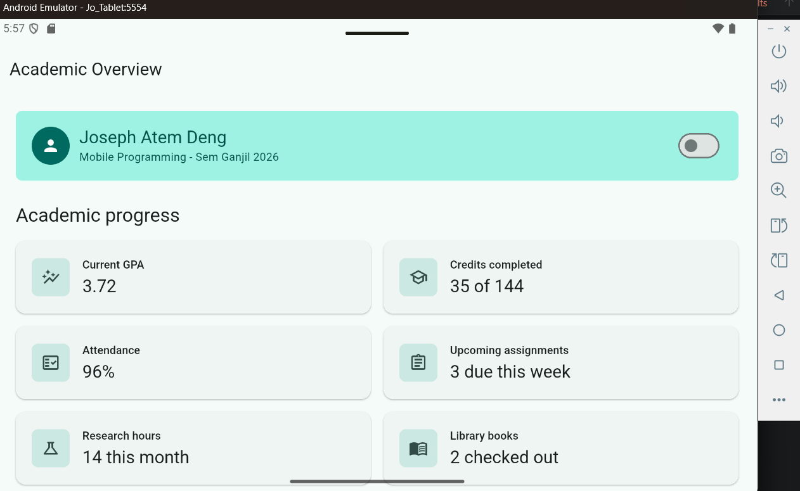
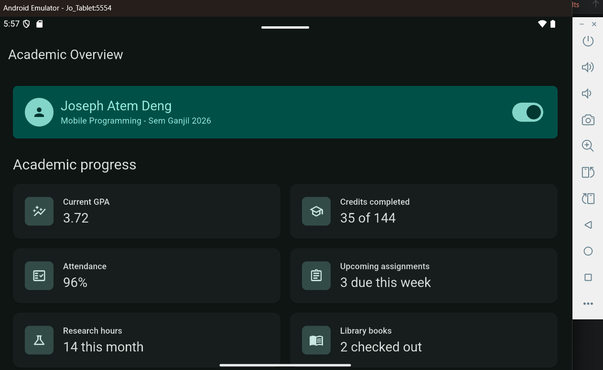
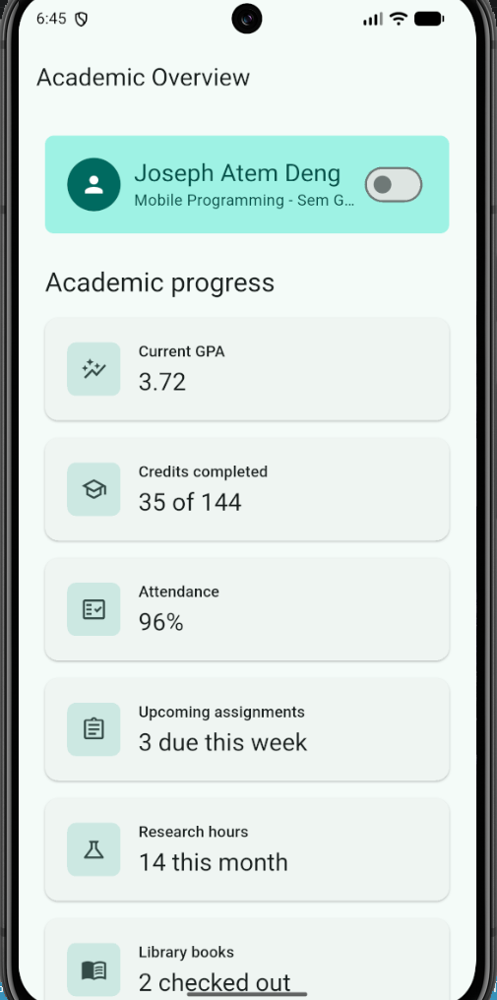
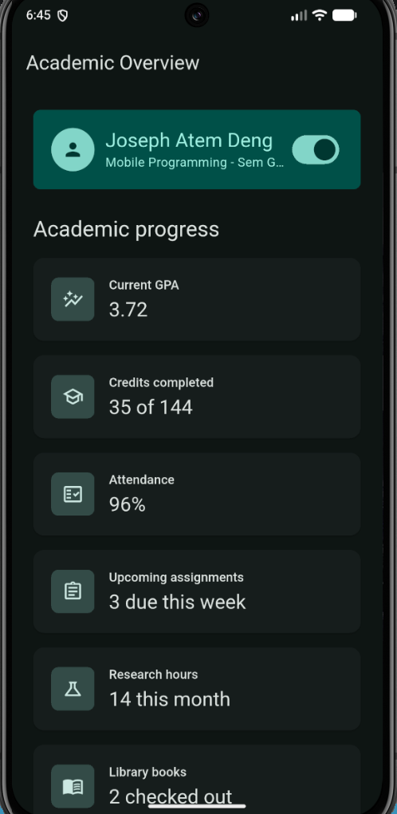
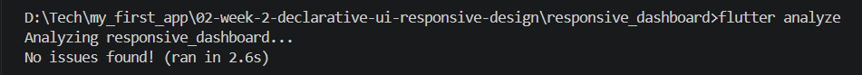
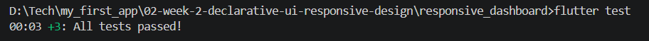

## Jobsheet: Matkul Mobile Programming Week 2

| *Informasi* | *Detail* |
| --- | --- |
| Mata Kuliah | Mobile Programming |
| Nama | Joseph Atem Deng Aruei |
| Absen | 17 |
| NIM | 244107020242 |

# Lab: simple layout (warm-up)

**After removing expanded**


**Replacing mainAxisSize**


**Adding one more data row (e.g. Email)**


# Lab: responsive dashboard

**Student dashboard**


**Change the 700 breakpoint and observe the column count.**


**Change themeMode to ThemeMode.dark, then restore ThemeMode.system.**


**Test the application at different emulator screen sizes.**

## Tablet Screen


## Phone screen


# Lab: Assignment and AI design exploration

## Overview

This Flutter application is an Academic Overview dashboard. It includes a student profile header, six academic information cards, responsive one-column and two-column layouts, accessible labels, and a light/dark theme switch.


## Extended Dashboard: Tablet




## Extended Dashboard: Phone

 

## Implementation Decisions

- `InfoCard` is a reusable widget that receives `title`, `value`, and `icon`.
- `kWideBreakpoint = 700` is the single responsive breakpoint.
- `LayoutBuilder` checks screen width:
  - Below 700 px: cards display in one `Column`.
  - At 700 px and wider: cards display in two columns using a `Row` with two `Expanded` widgets.
- `Theme.of(context).colorScheme` and `Theme.of(context).textTheme` provide theme-aware colors and text styles.
- `Switch.adaptive` changes between light and dark mode.
- `Semantics` labels describe the student profile, dashboard cards, and theme switch for screen-reader users.


## AI Design Exploration

### Design prompt

> Compare two Flutter academic dashboard layouts: a `GridView` version and a `LayoutBuilder` + `Column` version. Explain the responsive and accessibility trade-offs.

### AI response summary

A `GridView` works well for a large number of equally sized cards and can efficiently create multiple columns. However, cards with different content heights may leave unused space, and multi-column reading order needs careful accessibility testing.

A `LayoutBuilder` with `Column` widgets is easier to control for a small dashboard. It clearly switches between one and two columns at a named breakpoint. It also makes the narrow-screen reading order obvious.

### Selected decision

I selected `LayoutBuilder` with `Column` widgets because this dashboard has only six cards. The layout is easier to explain, responsive below 700 px, and uses `Expanded` only inside a bounded `Row`.

### Concept-reinforcement prompt

> Explain when using `Expanded` actually causes an overflow inside a `Row`; show failing example code and its fix.

### AI response summary

`Expanded` does not shrink fixed-width siblings. An overflow happens when the fixed children already need more width than the screen provides.

```dart
// Overflows on a 400 px-wide screen because 280 + 160 is already 440 px.
Row(
  children: const [
    SizedBox(width: 280, child: Text('Course code')),
    SizedBox(width: 160, child: Text('Deadline')),
    Expanded(child: Text('Status')),
  ],
)
```

### Fix
```dart
Row(
  children: [
    Expanded(
      flex: 2,
      child: Text('Course code', overflow: TextOverflow.ellipsis),
    ),
    const SizedBox(width: 12),
    Expanded(
      child: Text('Deadline', overflow: TextOverflow.ellipsis),
    ),
  ],
)
```

### Verification Prompt

Review the layout recommendation above: does it stay responsive below 600px, does it reduce accessibility, and are all widgets available in the current stable Flutter?

### AI Self-Audit

The layout remains responsive below 600 px because it uses one column under 700 px. It does not reduce accessibility because important information and the theme control have semantic labels. LayoutBuilder, Row, Column, Expanded, Container, Semantics, and Switch.adaptive are stable Flutter APIs.
Testing and Verification

### Results

- `flutter analyze`: No issues found.



- `flutter test`: All tests passed.




The widget tests verify:
- A 400 x 800 screen uses one column.
- A 1200 x 800 screen uses two columns.
- The cards have the expected responsive widths.
- The theme switch changes the active theme.


## Reflection

- Imperative UI programming focuses on the steps needed to change a screen, such as manually changing text or colors. Declarative UI programming describes what the screen should look like for the current state. In this project, changing the theme state rebuilds the interface in light or dark mode.

- `Expanded` helps a widget use the remaining available space inside a bounded `Row` or `Column`. It can cause an error or overflow when fixed-size siblings already use more space than is available, or when the `Row` has unbounded width. I used `Expanded` for text areas and the two wide-screen card columns.

- Breakpoints improve the user experience by changing the layout according to available width. My dashboard shows one readable card column on a phone and two columns on a tablet or wide screen. Themes improve readability in different lighting conditions and let users choose light or dark mode.

- After receiving the AI layout recommendation, I checked that the selected `LayoutBuilder` approach remained responsive below 600 px, kept accessibility labels for important information and the theme switch, and used stable Flutter widgets. I also ran `flutter analyze` with no issues, ran `flutter test` successfully, and captured narrow and wide screenshots.
