## Jobsheet: Matkul Mobile Programming Week 3

| *Informasi* | *Detail* |
| --- | --- |
| Mata Kuliah | Mobile Programming |
| Nama | Joseph Atem Deng Aruei |
| Absen | 17 |
| NIM | 244107020242 |

# Lab 1: Multi-page application with GoRouter

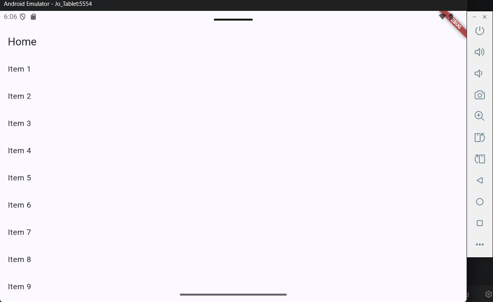

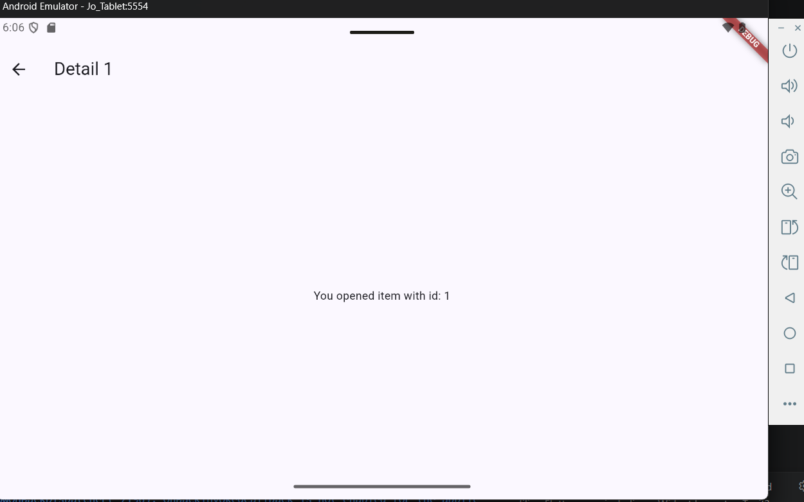

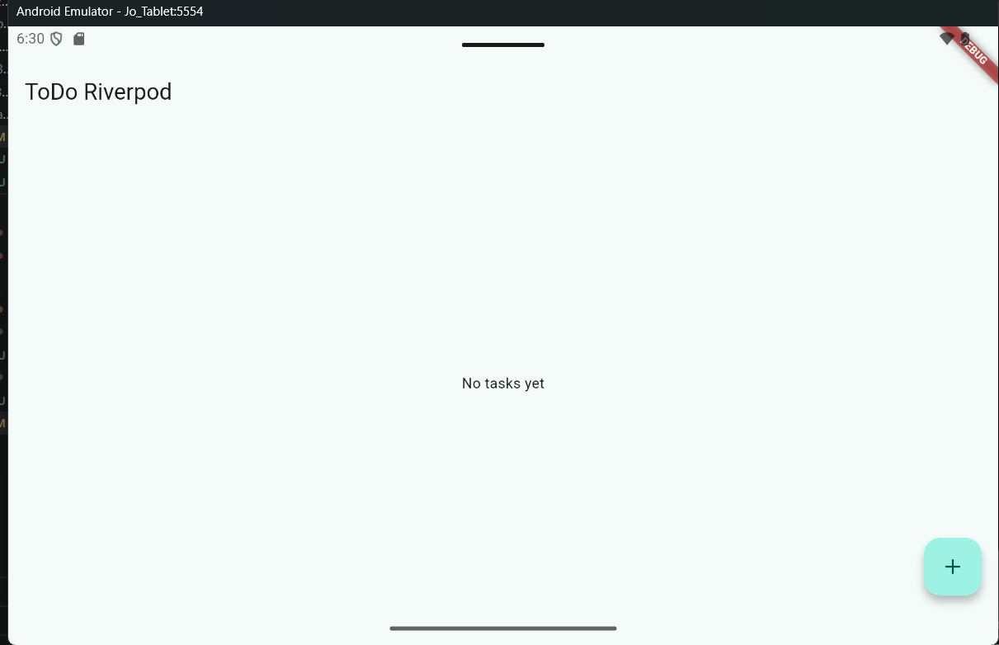

# Lab 3: Test all three states

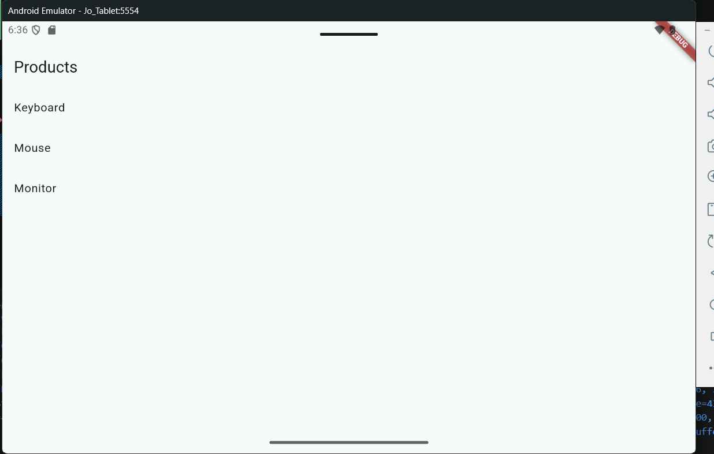
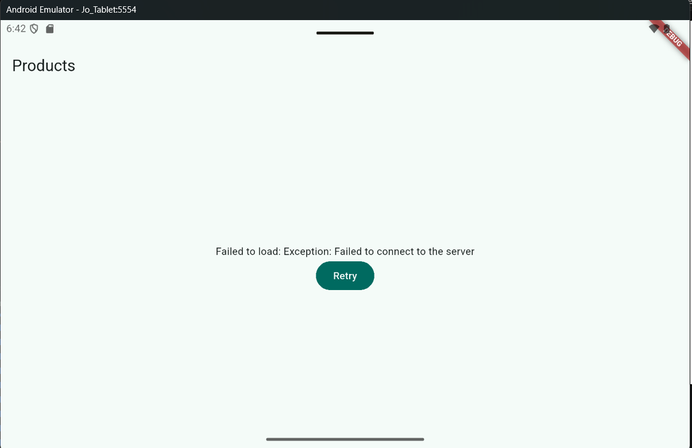

# AI Challenge

## Prompt Used
Create a Flutter page named StatsPage using flutter_riverpod.
Requirements:
- A ConsumerWidget with one AsyncNotifierProvider that simulates
  fetching statistics (2-second delay, ~30% chance of failure).
- The UI must handle loading (spinner), error (message + retry button),
  and success (ListView with 3 items).
- Provide a unit test for the notifier.
Explain each part of the code with comments.

## Verification Findings
- State is immutable: Yes. The provider assigns new `AsyncValue` objects and returns a new immutable list; it never calls `state.add()`.
- `ref.watch`: Used only in `StatsPage.build`.
- `ref.read`: Used only in the Retry button callback.
- Async states: Loading, error, and data are all handled with `AsyncValue.when`.
- Provider: One explicitly typed `AsyncNotifierProvider<StatsNotifier, List<StatItem>>` is declared.
- Riverpod API: Uses `AsyncNotifier`, `AsyncNotifierProvider`, and `ConsumerWidget`; no `StateNotifierProvider` or nested `Consumer` is used.
- Test reliability: The test injects fixed random values and removes the delay, so it never randomly fails or waits two seconds.

## Fixes Made
- Added an injectable random value and delay so tests are deterministic.
- Used `AsyncValue.guard` to convert request exceptions into `AsyncError`.
- Kept `ref.watch` in `build` and `ref.read` in the Retry callback.

## Test Results
- `flutter analyze`:

 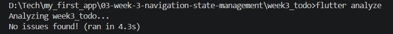

- `flutter test`:

 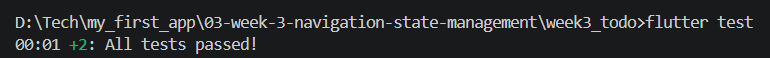

# Results:

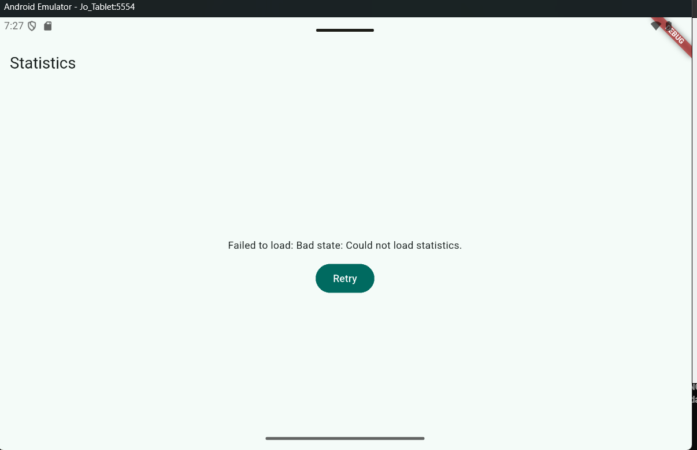

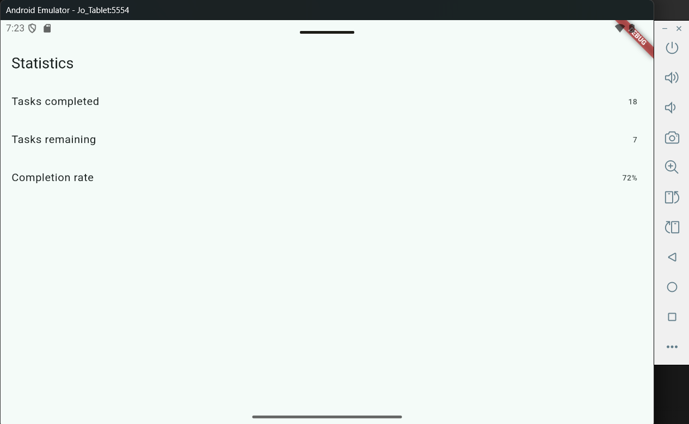

## Refactoring and testing

## Test Results
- `flutter analyze`:

 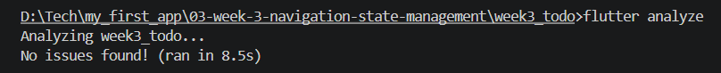

- `flutter test`:

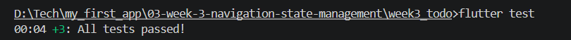

# Results:
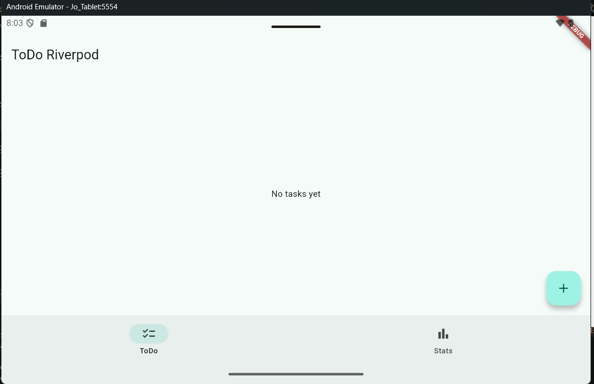

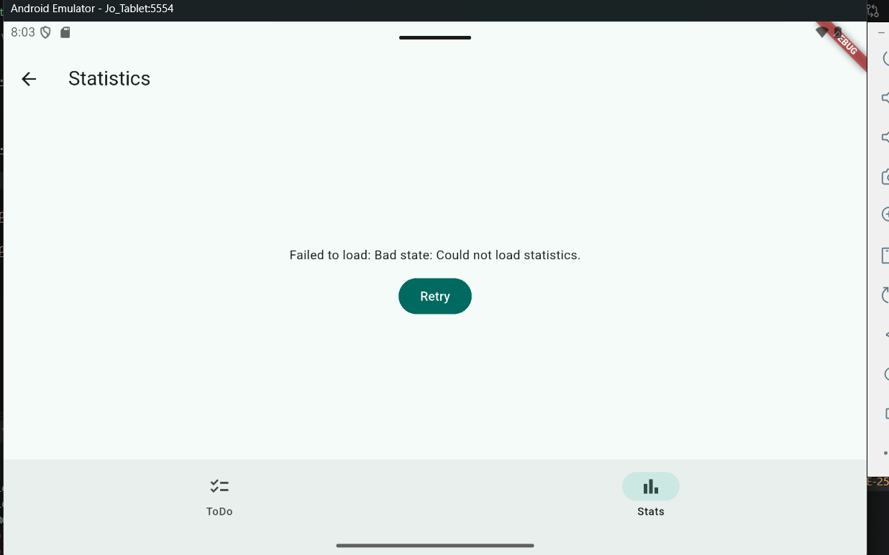

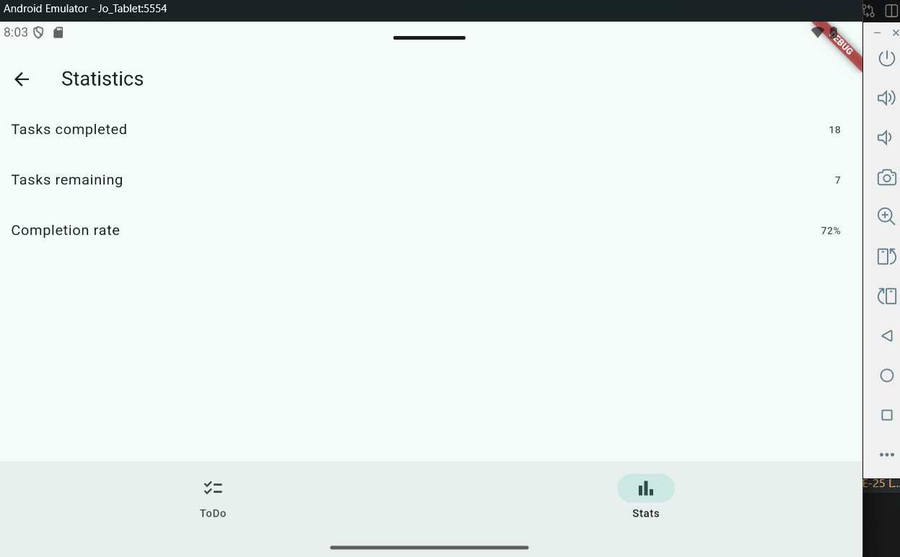

## Assignment, reflection, references