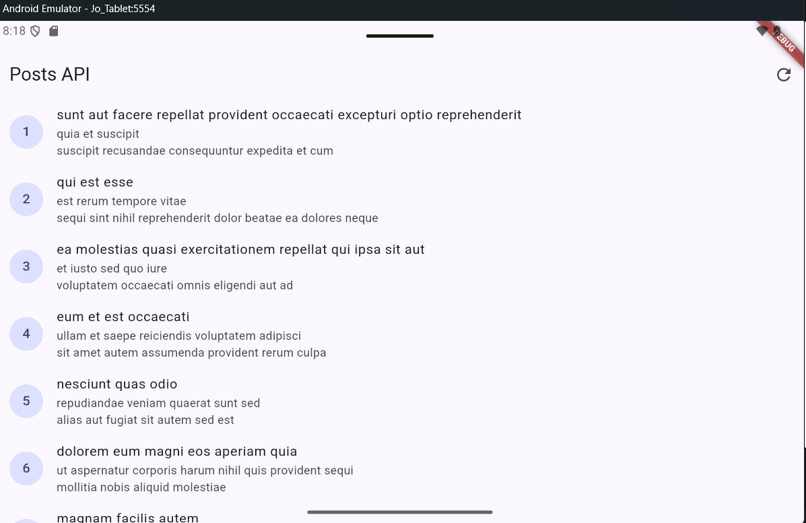
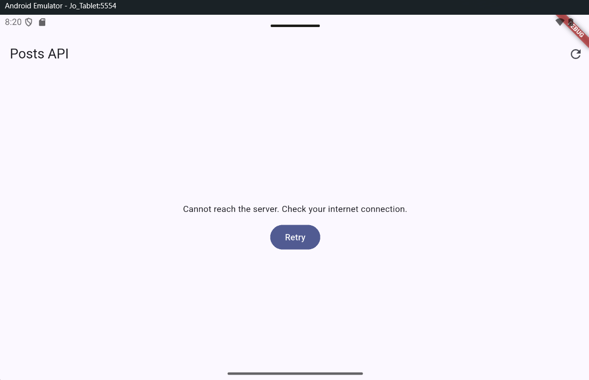
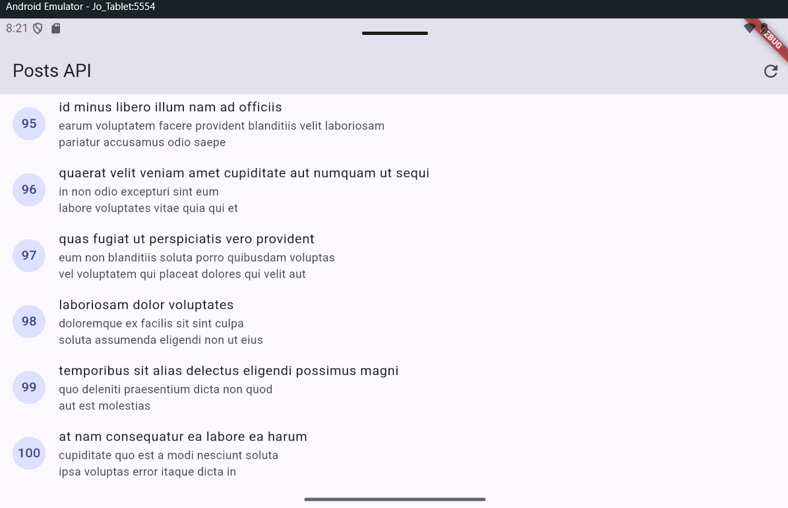
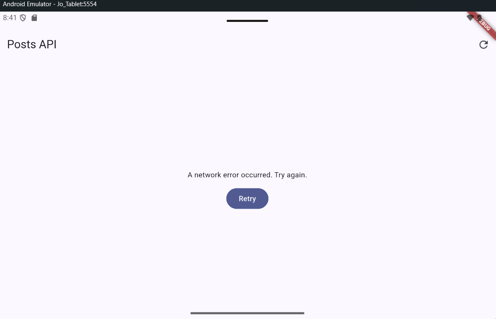
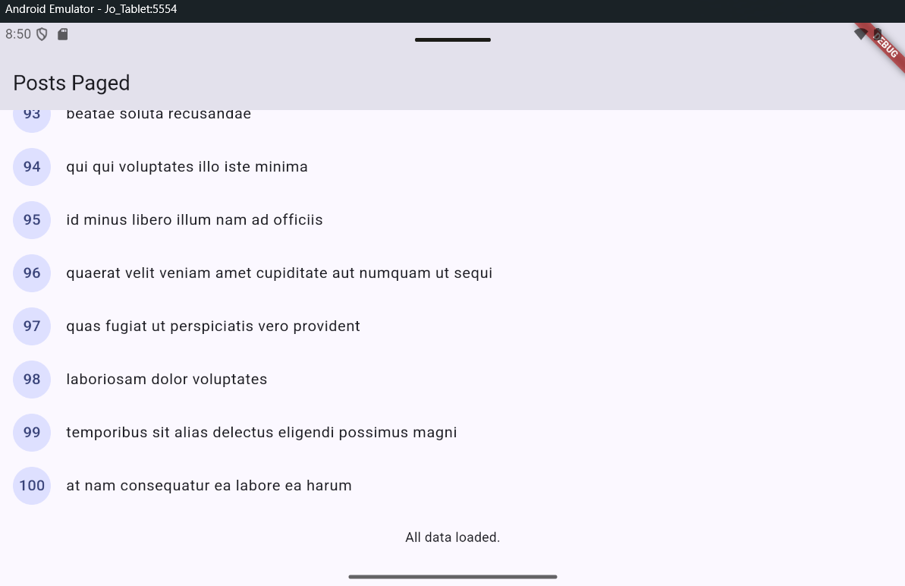

## Jobsheet: Matkul Mobile Programming Week 2

| *Informasi* | *Detail* |
| --- | --- |
| Mata Kuliah | Mobile Programming |
| Nama | Joseph Atem Deng Aruei |
| Absen | 17 |
| NIM | 244107020242 |

# Lab: simple layout (warm-up)

# Test three error scenarios

**1. Run the app with normal internet, observe loading, then the list of 100 posts.**

**2. Turn off the internet (airplane mode), press refresh, observe the friendly message + Retry button. Turn the internet back on, press Retry.**

**Internet back on**

**3. Temporarily change baseUrl to a wrong URL, observe the connection error message. Restore it after the test.**

# Lab 3: Basic pagination

**Result**

# Lab: Assignment and AI design exploration

## Overview

This Flutter application is an Academic Overview dashboard. It includes a student profile header, six academic information cards, responsive one-column and two-column layouts, accessible labels, and a light/dark theme switch.

## Extended Dashboard: Tablet

## Extended Dashboard: Phone

 

## Implementation Decisions

- `InfoCard` is a reusable widget that receives `title`, `value`, and `icon`.
- `kWideBreakpoint = 700` is the single responsive breakpoint.
- `LayoutBuilder` checks screen width:
  - Below 700 px: cards display in one `Column`.
  - At 700 px and wider: cards display in two columns using a `Row` with two `Expanded` widgets.
- `Theme.of(context).colorScheme` and `Theme.of(context).textTheme` provide theme-aware colors and text styles.
- `Switch.adaptive` changes between light and dark mode.
- `Semantics` labels describe the student profile, dashboard cards, and theme switch for screen-reader users.

# AI Challenge: JSONPlaceholder comments

## Prompt used

Create a Flutter repository layer for the GET /comments?postId={id}
endpoint of JSONPlaceholder using Dio + flutter_riverpod.

Requirements:
- Comment model with null-safe fromJson (postId, id, name, email, body).
- CommentRepository with fetchComments(postId) + 10-second timeout.
- AsyncNotifierProvider with automatic error handling (AsyncError)
  and a user-friendly error-message function for timeout,
  connection error, 404, and 500.
- One unit test for fromJson with missing fields.
Explain each part of the code with comments.

## Initial AI output

The first draft proposed a Comment model, a Dio-backed repository, a Riverpod
async provider, friendly Dio error messages, and a missing-fields model test.
The first review focused on whether malformed JSON values were handled safely
and whether the timeout was configured centrally.

## Fixes made after review

- `fromJson` checks each value's runtime type and supplies a default for missing
  or incorrectly typed fields.
- The API host and 10-second connect, send, and receive timeouts are centralized
  in `createDio`.
- `CommentRepository` builds the query parameter and parses the response.
- The UI can watch `commentListProvider(postId)` and does not need to call Dio.
- `friendlyErrorMessage` handles timeout, connection error, 404, and 500.
- The model tests cover missing fields and an additional malformed-types edge
  case.

## Verification checklist

- UI calls Dio directly: No; UI should watch the provider.
- `fromJson` handles missing and incorrectly typed fields: Yes.
- Timeout, connection error, 404, and 500 have user-facing messages: Yes.
- Base URL and timeouts are centralized: Yes, in `createDio`.
- Missing-field test and additional edge case are included: Yes.
- `flutter analyze`: Not run.
- `flutter test`: Not run.

Run `flutter analyze` and `flutter test` in the project, then replace the two
"Not run" entries above with the actual results before submitting.

### Results

- `flutter analyze`: No issues found.

- `flutter test`: All tests passed.

The widget tests verify:
- A 400 x 800 screen uses one column.
- A 1200 x 800 screen uses two columns.
- The cards have the expected responsive widths.
- The theme switch changes the active theme.

## Reflection

- Imperative UI programming focuses on the steps needed to change a screen, such as manually changing text or colors. Declarative UI programming describes what the screen should look like for the current state. In this project, changing the theme state rebuilds the interface in light or dark mode.

- `Expanded` helps a widget use the remaining available space inside a bounded `Row` or `Column`. It can cause an error or overflow when fixed-size siblings already use more space than is available, or when the `Row` has unbounded width. I used `Expanded` for text areas and the two wide-screen card columns.

- Breakpoints improve the user experience by changing the layout according to available width. My dashboard shows one readable card column on a phone and two columns on a tablet or wide screen. Themes improve readability in different lighting conditions and let users choose light or dark mode.

- After receiving the AI layout recommendation, I checked that the selected `LayoutBuilder` approach remained responsive below 600 px, kept accessibility labels for important information and the theme switch, and used stable Flutter widgets. I also ran `flutter analyze` with no issues, ran `flutter test` successfully, and captured narrow and wide screenshots.

