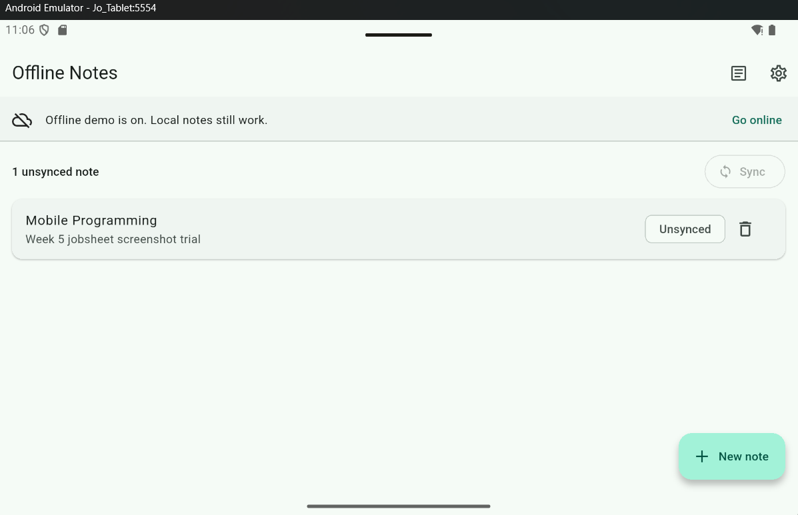
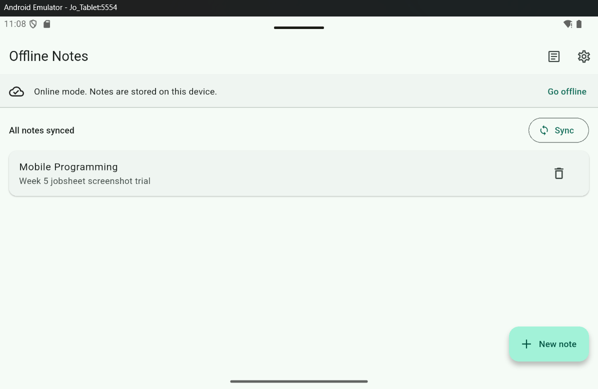
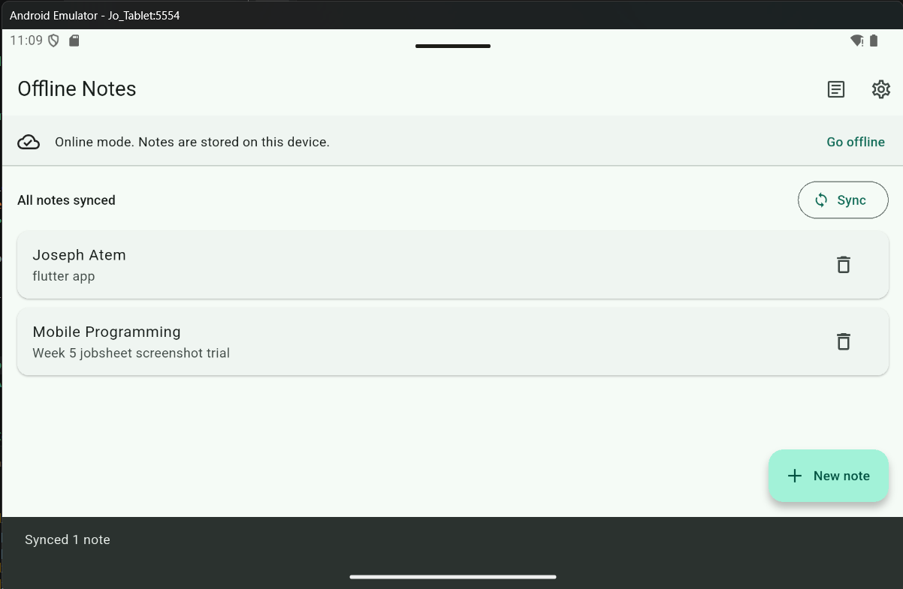
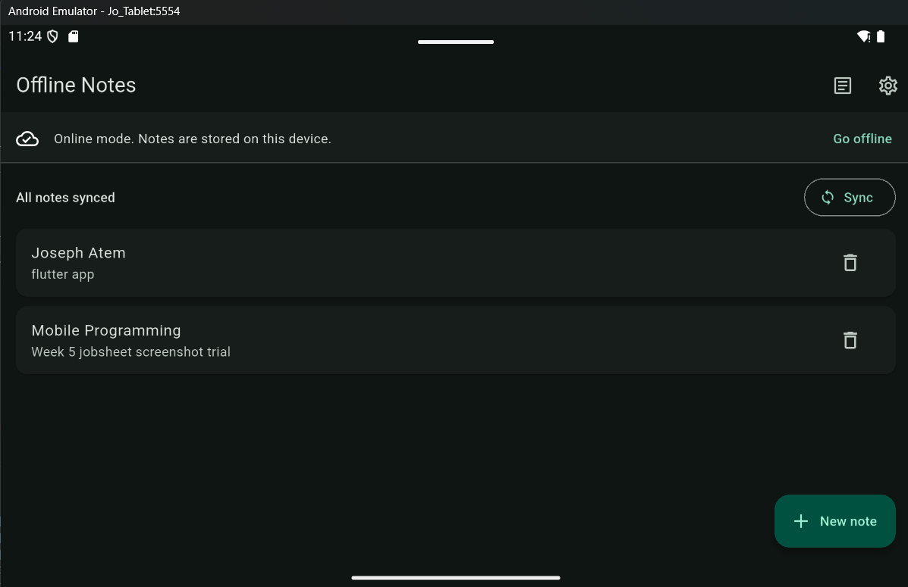
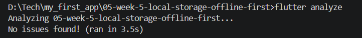

## Jobsheet: Matkul Mobile Programming Week 5

| *Informasi* | *Detail* |
| --- | --- |
| Mata Kuliah | Mobile Programming |
| Nama | Joseph Atem Deng Aruei |
| Absen | 17 |
| NIM | 244107020242 |


## Demo procedure

1. Add a note. Confirm its **Unsynced** chip and the pending count.



2. Enable airplane mode on the emulator/device and enable **Go offline** in the app. Confirm the saved note remains readable. Add or edit a note while offline to demonstrate local writes.
3. Capture the offline note list with its unsynced count visible.



4. Restore the connection and select **Go online**, but do not sync yet. Capture the note and count before sync.
5. Tap **Sync**. Capture the saved note after its dirty chip disappears and the count reaches zero.



6. Visit **Cached posts** while online once, then enable forced offline mode and revisit to demonstrate the saved post cache.
7. Change the dark-theme setting, close and reopen the app, and confirm it persisted.




## Conflict rule

For a future two-way server sync, use **last write wins by `updated_at`**. A server copy replaces local data only when the server timestamp is newer. If the local timestamp is newer, retain the local version and keep it dirty for upload. The current demo has no note-write endpoint and does not merge simultaneous edits.


# Storage decision and AI challenge

## Challenge prompt

> Flutter Offline Notes app: note CRUD + theme preference. Compare SharedPreferences, Hive, sqflite (SQLite), and Drift for query complexity, relational needs, reactivity (streams), type-safety, boilerplate size, and testability. Give a final recommendation for preferences and notes with reasons in one table. Show a table/box schema for 1,000+ notes and explain the trade-offs.

## Initial AI-generated answer

The AI draft recommended **SharedPreferences for preferences and Drift for notes**. SharedPreferences is a small key-value store for primitive values such as a theme setting or last-opened timestamp; it should not hold a serialized note collection. Drift is attractive for notes when the app needs generated, type-safe SQL queries, joins, and query streams. For 1,000+ notes, the draft proposed a relational `notes` table with an auto-increment ID, title, body, update timestamp, and dirty/sync flag, plus indexes on update time and sync state.

The draft also identified Hive as a lower-boilerplate embedded object store with box watchers and sqflite as direct SQLite access with flexible SQL but manual row mapping and refresh management. Its main trade-off was that Drift's reactive/type-safe features add code generation and setup; sqflite keeps a small project simpler but requires explicit repository/provider refreshes.

## Comparison and final decision

| Option | Query complexity | Relational needs | Reactivity / streams | Type safety | Boilerplate | Testability | Decision for this app |
|---|---|---|---|---|---|---|---|
| SharedPreferences | Primitive key lookup only | None | No database query streams | Primitive types | Very small | Easy to wrap behind a repository | Use for theme and last-opened time |
| Hive | Key lookups and box scans; less query composition than SQL | No SQL relations | Box watchers | Adapters and typed objects are available | Low to medium | Boxes can be wrapped or replaced in tests | A reasonable object-cache alternative; not selected for note queries |
| sqflite (SQLite) | SQL filters, ordering, joins, and indexes | Yes | No built-in query streams; refresh is explicit | Rows are manually mapped from maps | Medium | Repository accepts an injected database; providers can use fakes | Use for notes and cached posts |
| Drift | SQL, joins, and generated queries | Yes | Query streams are built in | Strong generated row/query types | Higher initially due to code generation | Typed APIs and in-memory database support | Best if this grows into a reactive app; more than this assignment needs |

**Final choice:** SharedPreferences stores the two small preference values. SQLite via `sqflite` stores notes and cached API posts. The app needs ordered note reads, partial updates, and persistent `updated_at`/`dirty` fields. Riverpod invalidates the note provider after repository mutations, so live SQL streams are not required. Direct sqflite has less setup than Drift while retaining SQL queries. Drift remains the better option if complex joins or reactive query streams become a real requirement.

## Example SQLite schema for 1,000+ notes

```sql
CREATE TABLE notes (
  id INTEGER PRIMARY KEY AUTOINCREMENT,
  title TEXT NOT NULL,
  body TEXT NOT NULL DEFAULT '',
  updated_at TEXT NOT NULL,
  dirty INTEGER NOT NULL DEFAULT 0
);
CREATE INDEX notes_updated_at_idx ON notes(updated_at DESC);
CREATE INDEX notes_dirty_updated_at_idx ON notes(dirty, updated_at);
```

The shipped app creates the codelab's base `notes` table and `cached_posts` table. It orders notes by `updated_at DESC`; the indexes above are a scale-oriented suggestion and have not been added as a schema migration. If an app with saved user data adopts them, add a versioned database migration rather than recreating the database.

## Implementation verification

- Notes are rows in SQLite, not a JSON list in SharedPreferences.
- Each local create or edit sets `dirty = 1`; `countDirty` reports pending notes.
- Riverpod exposes asynchronous loading, error, and data states; the UI does not call SQLite or SharedPreferences directly.
- `sqflite` queries are not reactive streams. The provider is invalidated after local mutations and sync.
- Note sync is simulated with a delay because the codelab provides no note-write endpoint. Dirty flags are cleared after simulated success. This is not production synchronization.
- The explicit conflict rule for a future two-way backend is **last write wins by `updated_at`**. A newer server timestamp replaces local data; otherwise the newer local copy remains dirty and should be uploaded.

## Reflection answers

### Why must the note list not be stored in SharedPreferences?

SharedPreferences is for small primitive values, not an expanding collection. Putting all notes in a JSON string makes filtering, ordering, partial updates, and synchronization fragile. SQLite gives each note a row with queryable fields and durable update state.

### When is cache-first enough, and when is another strategy better?

Cache-first works when the app should remain useful without a network, such as notes or a previously loaded feed. For data where freshness is essential, such as live prices, network-first is more suitable; the app can show the cached value if the request fails.

### How does a dirty flag become a sync queue, and when is an outbox needed?

A local create or edit sets `dirty = 1`. Sync selects pending records in a defined order, sends them, and clears the flag only after success. A separate outbox is useful when the app must preserve retries, deletes/tombstones, multiple pending operations on one record, or per-operation error/status information.

### Which part of the AI draft did the implementation reject?

The AI draft leaned toward Drift for notes because streams and generated types are valuable. The implementation chose sqflite for this small assignment: the SQL needs are straightforward and provider invalidation already refreshes the UI. Drift would add code generation without a current need for reactive SQL streams. SharedPreferences for preferences was retained; a note collection in SharedPreferences was rejected.

## Verification record

| Check | Result |
|---|---|
| Flutter / Dart | Flutter 3.47.2 / Dart 3.13.2 |
| Dependency resolution | Passed after enabling Windows Developer Mode; `PUB_CACHE` was placed on the same drive as the project to avoid cross-drive Kotlin paths |
| `flutter analyze` | Passed: no issues found |
| `flutter test` | Passed: 4 tests (model mapping, dirty serialization, provider success, provider error) |
| `flutter run` | Launched on the Pixel Tablet emulator. A Flutter `_dependents.isEmpty` debug assertion appeared once during a later session; retest to confirm whether it reproduces. |
| Offline note read/write and sync screenshots are above


## Assignment reflection answers

1. **Why not store the note list in SharedPreferences?** It is designed for small primitive settings, not collections. A JSON blob makes filtering, ordering, partial updates, and synchronization fragile; SQLite provides rows and queries for those needs.
2. **When is cache-first enough?** It suits content that should remain useful offline, such as notes or a previously loaded feed. For data where freshness matters more, such as live prices, prefer network-first and show a cached fallback if the request fails.
3. **How does a dirty flag become a sync queue?** Local writes set `dirty = 1`; the sync process selects pending rows, uploads them in a defined order, and clears the flag only after success. A separate outbox table becomes useful for durable retries, delete operations/tombstones, multiple operations on one record, or per-operation status.
4. **Which AI recommendation was rejected?** The initial AI draft considers Drift for notes because its generated SQL API and query streams provide stronger type safety and reactivity. For this small assignment, the final choice is `sqflite`: the required queries are simple, Riverpod refreshes after mutations, and the direct repository is easier to follow. Drift is a better next step if complex reactive queries become a real requirement.

## Verification status

- `flutter analyze`: passed with no issues.



- `flutter test`: passed, 4 tests.


- `flutter run`: launched successfully on the Pixel Tablet emulator after enabling Windows Developer Mode and placing the pub cache on the project drive.

