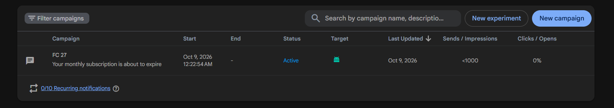
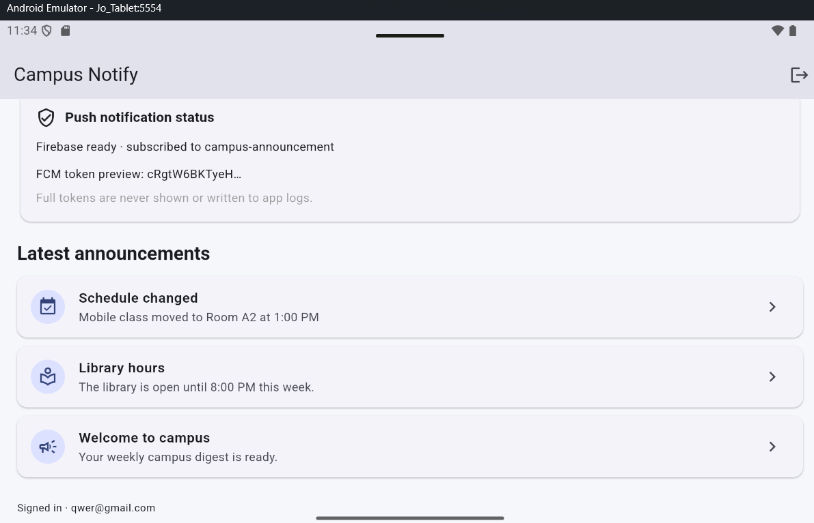
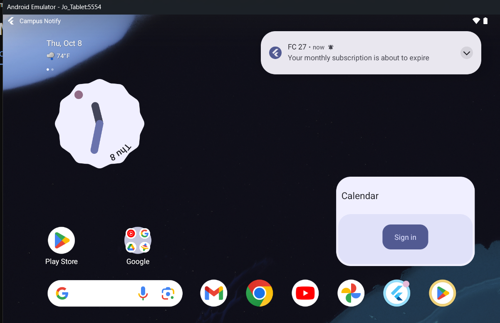
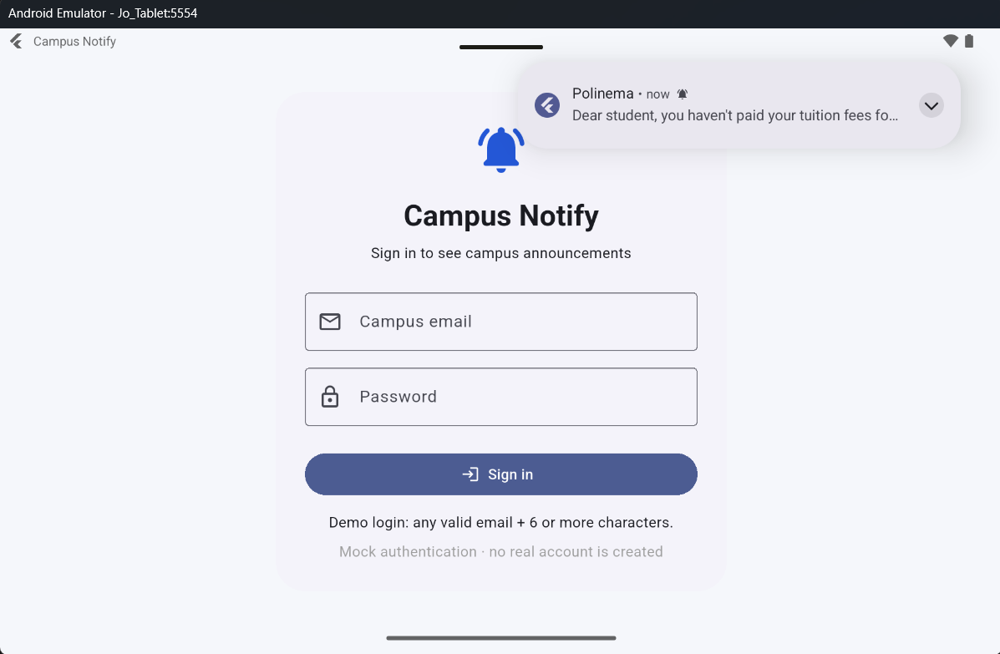
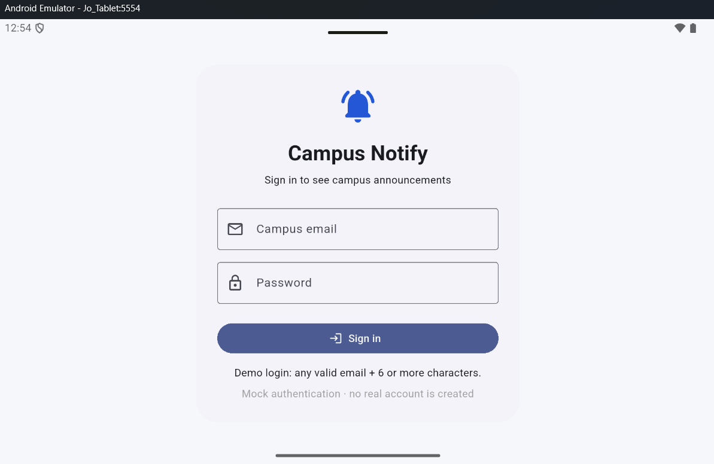
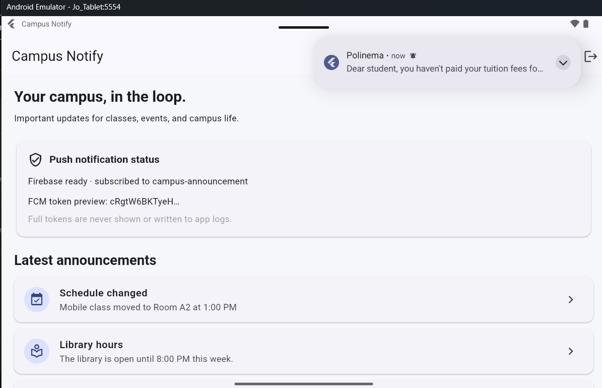
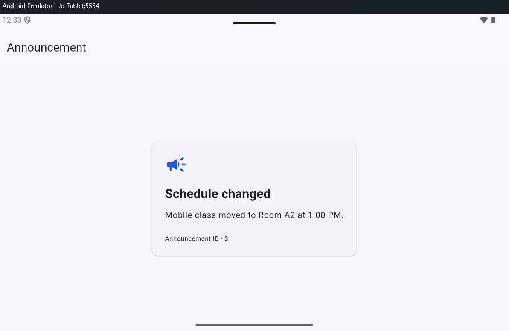

## Jobsheet: Matkul Mobile Programming Week 6

| *Informasi* | *Detail* |
| --- | --- |
| Mata Kuliah | Mobile Programming |
| Nama | Joseph Atem Deng Aruei |
| Absen | 17 |
| NIM | 244107020242 |

## Objective

Build a campus announcement app that demonstrates mock authentication, secure
token storage, a one-time access-token refresh after HTTP 401, guarded routes,
and Firebase Cloud Messaging (FCM) notification handling.

## Features and stack

- Flutter, Riverpod, GoRouter, and Dio.
- Mock email/password login (valid email and password of at least six
  characters); this does not create a Firebase Auth account or issue real JWTs.
- Access and refresh token storage through `flutter_secure_storage`.
- Dio attaches the access token, refreshes once after a 401, retries once, and
  clears the session if refresh fails.
- FCM permission request, token retrieval and refresh listener, topic
  subscription, foreground local notifications, background-tap handling, and
  terminated-state initial-message handling.
- Pure route parsing in `lib/routes.dart` and Dio-to-user-message mapping in
  `lib/data/api_errors.dart`.

## Run on Android

Use an Android emulator image with Google Play services or a physical Android
device. From this directory:

```powershell
flutter pub get
flutter run
```

Sign in with any valid email address and a password of at least six characters.

### Firebase setup

The Android app is registered with package ID
`com.example.campus_notify`. Its Firebase configuration is
`android/app/google-services.json`; the Google Services Gradle plugin is
applied when that file is present. Firebase must initialize successfully
before the app can register an FCM token.

The codelab repository does not include a real campus API. By default, the app
does not send tokens to a made-up server. To send initial and refreshed tokens
to a real campus backend, run with:

```powershell
flutter run --dart-define=CAMPUS_API_BASE_URL=https://your-campus-api.example
```

The configured backend must accept `POST /devices` with
`{"fcm_token":"…","platform":"android"}`. Without a backend URL, the app
still demonstrates Firebase token registration and topic subscription locally.

## Authentication and token theory

### Common authentication patterns

- **Firebase Authentication:** the Firebase SDK verifies login credentials
  and supplies an ID token that a backend can verify.
- **OAuth login:** the app obtains an authorization result (commonly an
  authorization code); the provider or backend exchanges it for tokens.
- **JWT access/refresh flow:** a campus API issues a short-lived access token
  and a longer-lived refresh token. The app sends the access token with API
  requests and exchanges the refresh token after an expired-token response.
- **This exercise:** login and refresh are mocked so the flow can run without a
  campus backend. The mock strings are not real JWTs and must not be treated as
  production credentials.

### ID, access, and refresh tokens

- An **ID token** describes the authenticated user; a backend verifies its
  signature and claims to establish identity.
- An **access token** grants temporary permission to call an API and is sent
  in the `Authorization: Bearer` header.
- A **refresh token** is a longer-lived credential used to obtain a replacement
  access token. It belongs in secure platform storage, never in a URL or
  ordinary preferences.

## FCM architecture and payload behavior

The app requests notification permission, obtains an FCM registration token,
and forwards the token through the configured `POST /devices` callback when a
backend URL is supplied. Firebase routes messages to the app instance or topic.
This app subscribes to `campus-announcement`; the backend/server is not
implemented in this codelab repository.

The project expects combined messages: `notification.title` and
`notification.body` provide visible text, while `data.route` and `data.id`
carry the in-app destination. The demonstration payload is:

```json
{
  "message": {
    "topic": "campus-announcement",
    "notification": {
      "title": "Schedule changed",
      "body": "Mobile class moved to Room A2 at 1:00 PM"
    },
    "data": {
      "route": "/announcement/3",
      "id": "3"
    }
  }
}
```

In the foreground, Android does not automatically display an FCM notification;
the app displays a local notification. In the background or terminated state,
Android displays a notification payload in the system tray. Tapping it delivers
the data payload to the relevant open/initial-message handler. A campaign with
only title/body opens the app home route; it does not prove the
`/announcement/3` deep link.

## Assignment test matrix and current results

| State | Required result | Current result | Evidence / next step |
| --- | --- | --- | --- |
| Foreground | Local banner appears; tapping a combined-payload notification opens `/announcement/3` | Pending manual device test | Keep the app open, send a message containing `data.route=/announcement/3`, then tap the local banner. Capture `foreground-banner.png` and the announcement page. |
| Background | System banner appears; tapping the combined-payload notification opens `/announcement/3` | **Notification delivery passed.** Firebase Console campaign appeared while the app was in the background; tapping reopened Campus Notify at home. The announcement deep link was not demonstrated by that title/body campaign. | `fcm-console-test.png` records the banner; `fcm-console-opened.png` records the app after tap. To prove deep linking, send custom data `route=/announcement/3` and `id=3`, then capture the announcement page. |
| Terminated | Tapping the banner opens `/announcement/3` through `getInitialMessage()` | Pending manual device test | Close the app from Android Recents (swipe its task away; do not use Android Settings' **Force stop**), send a combined-payload notification, tap it, and capture `terminated-banner.png` plus the announcement page. |

The app’s home screen showed **Firebase ready**, the
`campus-announcement` subscription, and a truncated FCM token. The full token
must not appear in screenshots or logs. The current campaign proves that the
Android device received a background notification; it does not prove all three
states or a custom deep-link destination.

### Screenshot evidence

- [Firebase Console campaign list] 
- [Truncated token and Firebase-ready home screen] 
- [Firebase Console notification banner while app is backgrounded] 
- [Campus Notify opened after tapping the banner] 
- [Login (mock/Firebase Auth) with a route guard: unauthenticated users are always redirected to /login.] 
  unathenticated user see the notification 

  

  Unathenticated click the notifcation

  
  
- [ ] Foreground local notification banner and `/announcement/3` destination. 
- [ ] Background notification tap landing on `/announcement/3` with custom
  data. 
- [ ] Terminated-state notification tap landing on `/announcement/3`. 


# AI Challenge — PushService review

## Prompt from the codelab
> Flutter Campus Notification App. Stack: firebase_messaging,
> flutter_local_notifications, flutter_secure_storage, go_router, Riverpod.
> Generate a PushService with:
> - requestPermission + getToken + onTokenRefresh (send to POST /devices)
> - onMessage (show a local notification manually)
> - onMessageOpenedApp + getInitialMessage (navigate to data.route)
> - subscribe/unsubscribe topic campus-announcement
> - top-level background handler with @pragma('vm:entry-point')
> Mark which parts DIFFER for Android 13+ vs iOS, and which parts must never
> touch BuildContext.

## Initial AI output

The initial draft reviewed for this assignment is preserved verbatim in
[`initial-ai-push-service.txt`](initial-ai-push-service.txt). It is the
PushService draft that was first pasted into the project discussion.

## Manual validation and fixes

- Updated `flutter_local_notifications` calls to use the named arguments
  required by the installed package version (`show(id:, title:, body:,
  notificationDetails:)` and `initialize(settings:)`). The old positional calls
  did not compile.
- Kept the background handler top-level and annotated it with
  `@pragma('vm:entry-point')`. It only initializes Firebase; it does not use
  `BuildContext`, Riverpod, the router, or UI state.
- Kept `onTokenRefresh` connected to the same callback as the initial token.
  When `CAMPUS_API_BASE_URL` is supplied, that callback posts
  `fcm_token` and `platform` to `POST /devices`; this repository has no real
  campus backend, so no endpoint is invented or called by default.
- Kept combined `notification` and `data.route` handling. Foreground messages
  are shown manually, while background taps use `onMessageOpenedApp` and
  terminated-state taps use `getInitialMessage`.
- Kept topic subscribe/unsubscribe for `campus-announcement` and made route
  parsing a pure function in `lib/routes.dart`.
- Firebase now initializes before `runApp`, as required by the setup section.
  If the platform config is absent, the mock-auth exercise remains usable and
  FCM is marked unavailable. Real FCM still requires the Firebase console
  registration and Android config described in the README.

## Platform differences

- Android 13 and later require runtime notification permission. Android also
  creates the `announcement` notification channel before foreground display.
- iOS requests alert, badge, and sound authorization and requires the APNs key
  and Push Notifications capability in Xcode for actual delivery.
- The background handler runs in a separate isolate on either platform. It
  must not use `BuildContext`, Riverpod state, or router navigation. Navigation
  happens after a notification is tapped and the app is active.

## Decision and rationale

The draft’s event flow is appropriate for the codelab, but its original
positional local-notification calls do not match the installed package API, so
they had to be changed for the project to compile. Token values are never
printed or shown in full. The displayed debug token is truncated. The backend
callback is configurable because this codelab repository has no real campus
API; this avoids sending a real token to an invented endpoint. The mock login
is also explicitly not Firebase Authentication and does not issue real JWTs.

## AI verification checklist and observed results

| Codelab check | Code review | Device evidence / status |
| --- | --- | --- |
| Background handler is top-level and has `@pragma('vm:entry-point')` | Pass. It initializes Firebase only; it does not use UI, Riverpod, or router state. | No separate screenshot needed. |
| `onTokenRefresh` forwards the new token to the backend | Pass when `CAMPUS_API_BASE_URL` is configured; otherwise the callback deliberately stops after updating the truncated UI preview because there is no backend in this repo. | Emulator showed Firebase ready and a truncated token. Backend receipt/rotation has not been demonstrated. |
| Foreground notification is displayed manually | Code uses `onMessage` and `flutter_local_notifications`. | Foreground device test remains pending. |
| Foreground, background, and terminated taps reach the correct deep link | Handlers exist for local-notification responses, `onMessageOpenedApp`, and `getInitialMessage`, using the pure route parser. | Firebase Console background notification delivery passed and tapping reopened the app home. The campaign did not demonstrate `data.route=/announcement/3`; foreground and terminated tests remain pending. |
| Full tokens/secrets are not hardcoded, shown, or logged | Pass in app UI and code; only a truncated token preview is shown. | Existing home screenshot shows the truncated preview only. |
| Final decision and technical rationale are documented | Accept the flow after correcting notification-plugin API calls; retain the documented mock/backend boundary and require device evidence before claiming full FCM correctness. | Analyze/tests and remaining device checks are recorded in the project README. |

## Platform and isolate constraints

- Android 13+ requires runtime notification permission; Android local
  notifications also use a notification channel.
- iOS requests alert/badge/sound permission and requires APNs configuration and
  the Push Notifications capability before remote delivery can be tested.
- The Firebase background callback runs outside the normal UI flow. It must
  not access `BuildContext`, Riverpod providers, or GoRouter. Routing is done
  when the app handles the user's notification tap.


## Theory and reflection answers

1. **Why must refresh tokens not be stored in SharedPreferences?** Shared
   preferences are ordinary app preferences, not the platform credential
   stores intended for secrets. If a refresh token is extracted from a
   compromised or backed-up app, an attacker may keep requesting access tokens
   until the refresh token expires or is revoked. This project uses
   `flutter_secure_storage`, backed by Android Keystore/iOS Keychain.
2. **What breaks if `onTokenRefresh` is ignored for a semester?** Firebase can
   rotate the registration token. If the backend keeps only the old token, it
   sends to a stale registration and that installation can stop receiving
   messages. The listener forwards every refreshed token through the same
   backend callback used for the initial token.
3. **When should a topic or a device token be used?** A topic is for a
   non-personal broadcast, such as a campus-wide library-hours update or a
   class schedule change. A device token targets one app installation for a
   private message. Personal grades, account notices, and billing details
   should never be broadcast to a topic.
4. **Which AI draft part was changed, and why?** The draft passed positional
   arguments to `flutter_local_notifications` methods that require named
   arguments in the installed package version, which caused compile errors.
   The calls were corrected and verified by building/running on Android. The
   background handler was kept top-level and isolated from `BuildContext`,
   Riverpod, and router state. The campaign test confirms background delivery
   and app launch, while foreground, terminated, and deep-link routing still
   need their own evidence.

