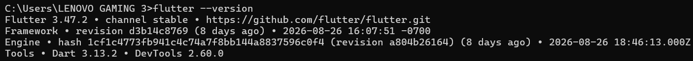
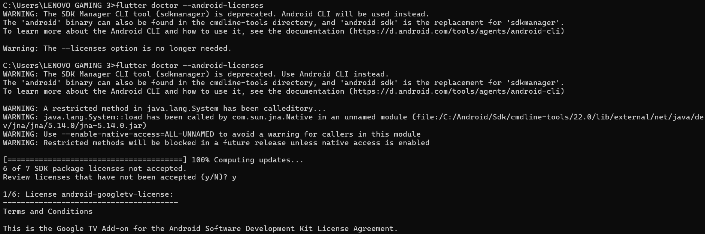
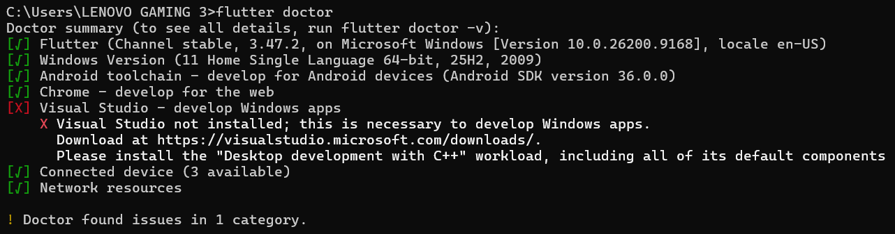
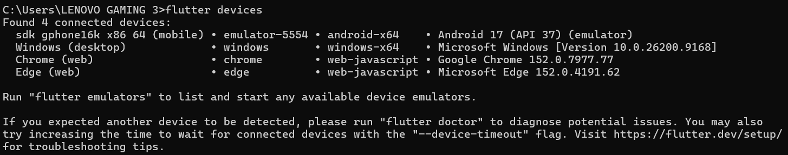
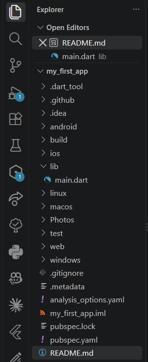
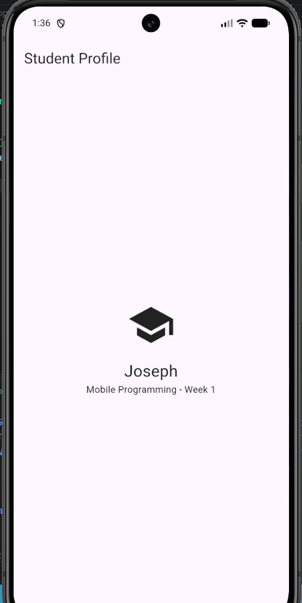
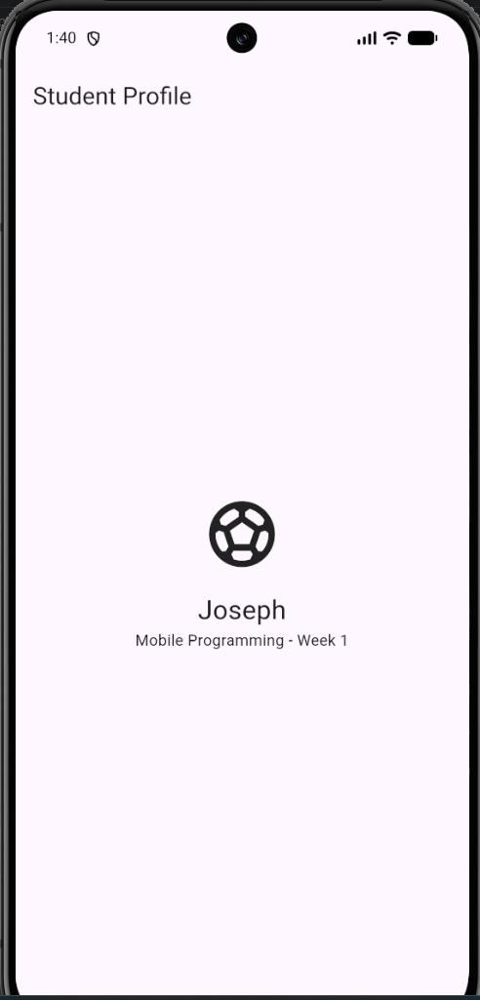

## Jobsheet: Matkul Mobile Programming Week 1

| *Informasi* | *Detail* |
| --- | --- |
| Mata Kuliah | Mobile Programming |
| Nama | Joseph Atem Deng Aruei |
| Absen | 17 |
| NIM | 244107020242 |

# Settting up the development environment

**Flutter Version**

**Flutter doctor**

**Flutter Dcotor Android Licenses**

**Flutter devices**

**Creating and running the project**

**Before changing the icon**

**After changing the icon**

## 📝 Reflection

---

## Reflection

**1. When is native development more appropriate than cross-platform development?**
Native development (using Swift/Kotlin) is more appropriate than cross-platform frameworks (like Flutter/React Native) when an application demands maximum hardware performance, low-level platform APIs, or immediate adoption of brand-new OS features. Apps like high-fidelity 3D mobile games, complex video/audio editing software, or apps heavily relying on deep background processes and device-specific sensors benefit from native access without wrapper overhead or bridge limitations.

**2. How does a state change relate to the widget tree and declarative UI?**
In a declarative UI system like Flutter, the user interface is a direct function of the application state (UI = f(state)). Instead of manually modifying UI elements directly (like hiding a text block in imperative coding), you modify the underlying data state. When a state change occurs, it triggers a rebuild of the widget tree. Flutter intelligently traverses the tree, compares the changes, and redraws only the specific widgets impacted by that state modification.

**3. Why are small commits with clear messages useful for teamwork and a portfolio?**
Small, atomic commits act as an incremental undo history and insurance policy for your codebase. For teamwork, they prevent massive merge conflicts, make code reviews much easier, and allow developers to isolate or revert specific bugs without breaking unrelated features. For a professional portfolio, tiny commits serve as a transparent timeline of your engineering thought process, proving to employers that you work methodically and maintain clean documentation habits.
